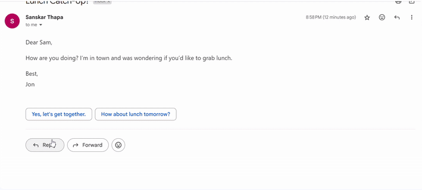
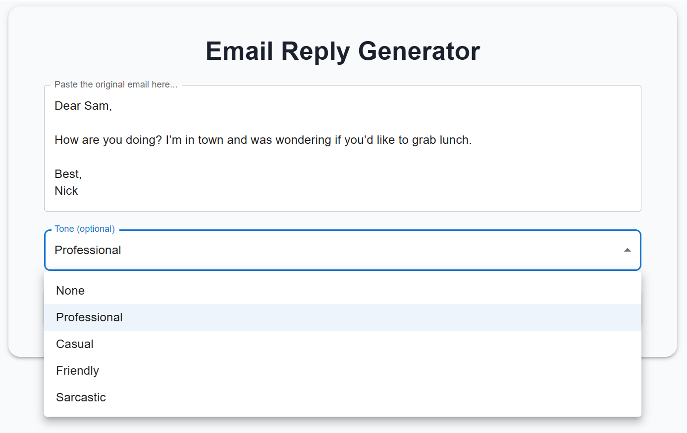
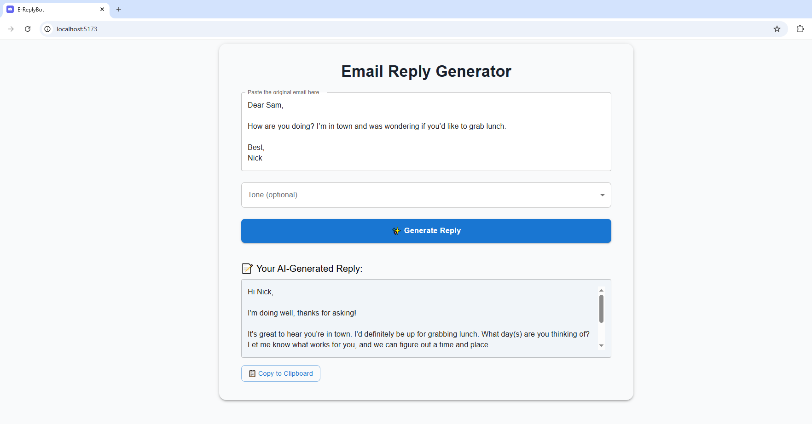

# auto-eresponse

**AI-Powered Email Response Generator**  

Automatically generate email replies tailored to your tone (professional, friendly, casual, or sarcastic) using **Gemini 2.0 AI**.  
Once set up, the component is triggered when you want to reply to an email.

<p align="center">
  
</p>

---

## Features  
- **Tone Selection**: Choose from 4 response styles (professional, friendly, casual, sarcastic).  
- **AI Integration**: Powered by **Google Gemini 2.0** for context-aware replies.  
- **Browser Extension**: Injects reply buttons dynamically into email clients (Gmail).  
- **REST API**: Spring Boot backend for scalable AI processing.  
- **React UI**: Modern, customizable frontend.

---
## 📸 Frontend UI  
<div align="center">
  
  
</div>
---

## Tech Stack  
### **Backend**  
- **Java 23** + **Spring Boot** (Maven)  
- **Dependencies**:  
  - Lombok (boilerplate reduction)  
  - Spring Web (REST APIs)  
  - WebFlux (reactive web support)  
  - Gemini 2.0 API (AI responses)  
- **Tools**: Postman (API testing)  

### **Frontend**  
- **React**  
- **MUI** (Material-UI components)  
- **Axios** (HTTP requests)  

### **Browser Extension**  
- **MutationObserver** (DOM change detection)  
- Dynamic UI injection (e.g., Gmail buttons)  

---

## 🚀 Quick Start  
### **Prerequisites**  
- JDK 23, Maven, Node.js (v18+), npm/yarn  

### **Run Locally**  
1. **Clone the repo**:  
   ```bash  
   git clone https://github.com/sanMakesApps/auto-eresponse.git

2. **Backend**:
   ```bash  
   cd backend  
   mvn spring-boot:run  # Starts at http://localhost:8080

3. **Frontend**:
    ```bash  
   cd ../frontend  
   npm install
   npm run dev # Runs at http://localhost:5173/

4. **Extension**:
   Load the extension/ folder in Chrome/Edge via chrome://extensions (Developer mode).

## 📂 Project Structure

e-replybot/  
├── assets/               # Demo GIFs & screenshots  
├── backend/              # Spring Boot (API + AI logic)  
│   ├── src/  
│   ├── pom.xml           # Maven dependencies  
│   └── ...  
├── frontend/             # React UI  
│   ├── src/  
│   ├── package.json      # Frontend dependencies  
│   └── ...  
├── extension/            # Browser extension  
│   ├── manifest.json     # Extension config  
│   └── ...  
├── .gitignore            # Global ignore rules  
└── README.md


## 🌟 API Endpoints
| Endpoint            | Method | Request Body                              | Description                     |
|---------------------|--------|-------------------------------------------|---------------------------------|
| `/api/generate`     | POST   | `{"emailContent":"Hi", "tone":"friendly"}`| Generates AI email response     |
| `/api/tones`        | GET    | -                                         | Lists available response tones  |


1. **Example Request**:
   ```bash  
   curl -X POST http://localhost:8080/api/email/generate \
   -H "Content-Type: application/json" \
   -d '{"emailContent": "Hello, thank you for reaching out to us.", "tone": "friendly"}'

2. **Example Response**:
    ```bash  
   {
      Hi there,
      You're very welcome! We're happy to hear from you.
      Please let us know if you have any specific questions or if there's anything we can help you with. We're here to assist in any way we can.
    }

## 🛠️ Build & Deployment

1. **Backend**:
   ```bash  
   cd backend
   mvn clean package   # Builds JAR in target/
   java -jar target/*.jar

2. **Frontend**:
    ```bash  
   cd frontend
   npm install
   npm run build       # Production build in build/

3. **Extension**:
   Open chrome://extensions
   Enable **Developer mode**
   Click **Load unpacked** → Select extension/

## 🤝 Contributing

1. Fork the repository
2. Create your feature branch
    ```bash
   git checkout -b feature/amazing-feature
4. Commit changes
   ```bash
   git commit -m 'Add amazing feature'
6. Push to branch
   ```bash
   git push origin feature/amazing-feature
8. Open a Pull Request
